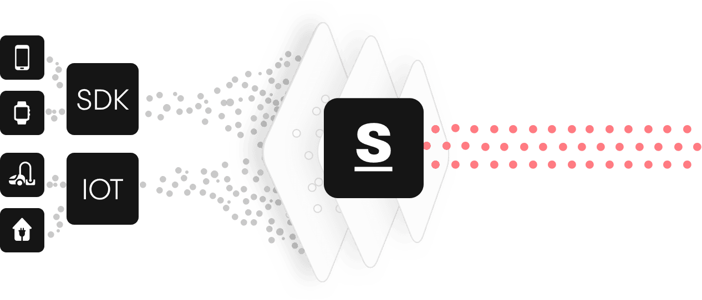
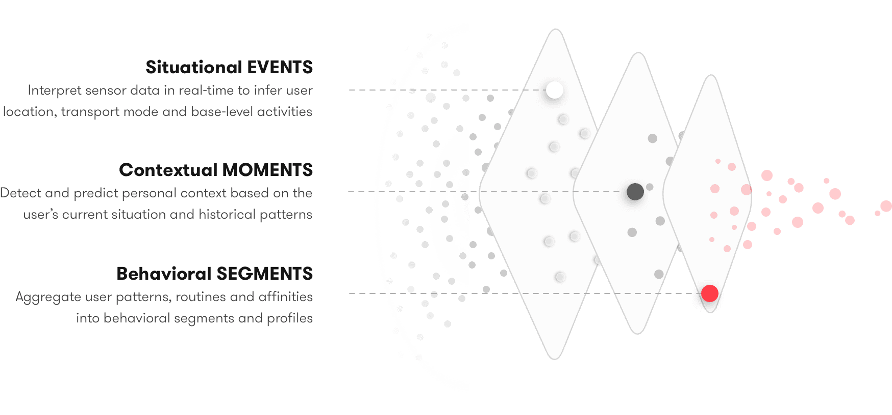
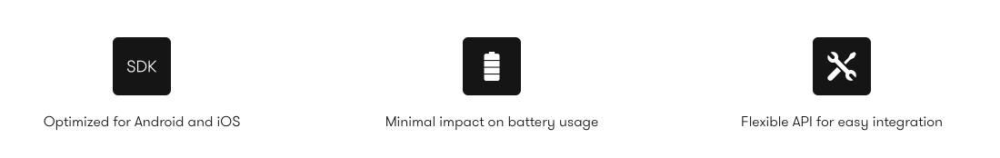
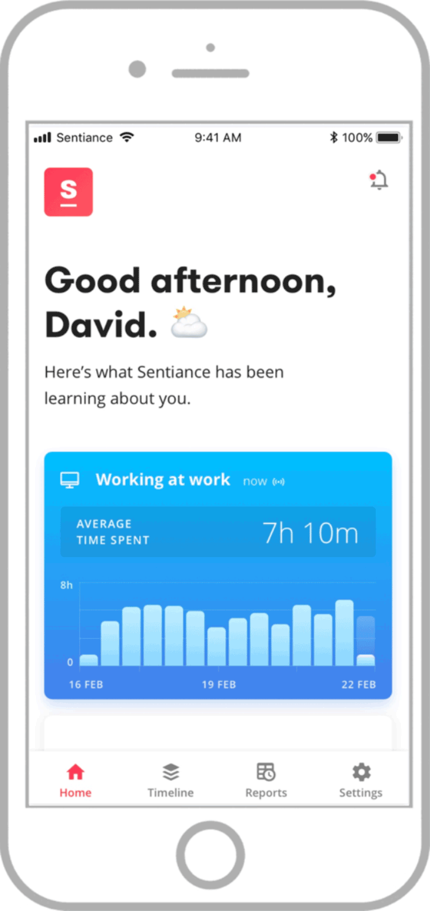

# What is Sentiance Platform?

## What is Sentiance Platform?

Sentiance platform helps improving your users' experience by learning and anticipating key moments that matter for the users.

This is how it's done.

First, collect GPS and motion sensor data from a user's phone or IOT devices via our SDK.

Once the data is collected, we turn this into valuable insights about the user then group them into EVENTS, MOMENTS, and SEGMENTS. 

In other words, we give you an understanding of where the user likes to go, what the user likes to do, and provide an insight into the persona of the user.

## Mobile SDK: designed for efficiency, built for accuracy

* Available for Android and iOS.
* Easy integration in mobile apps.
* Optimized for accuracy and battery usage.
* Minimal bandwidth usage during data collection.

## API for all your needs

We offer two types of API endpoints. [REST API](api/rest-api.md) that covers most of your needs and [GraphQL API](api/graphql-api.md) that will cover all your most complex use cases.

## Demo App

Try Journeys to see how the Sentiance platform learns about your journey.

