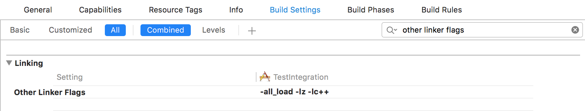

# 3. Compiler build settings

 This document refers to deprecated parts of the platform and has been left intact to help customers with legacy integrations. In order to access the latest platform features and documentation, please go to https://docs.sentiance.com. 

1. Go to the **Build Settings** tab of your target settings
2. Look for **Other Linker Flags** in the **Linking** section
3. Add `-lz`, `-all_load` and `-lc++`

