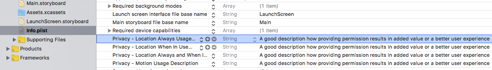

# 4. Changing Info.plist

### Permission message

As Sentiance SDK requires a user's location and motion data, it is required to get the permissions from the user before collecting such data.


Keep the text short and specific, use sentence case, and be polite so people don't feel pressured. There’s no need to include your app name.


When the application requests permission for background locations or motion activities, a message will be shown to the user. You can configure this message by changing the value for the following keys in `Info.plist`

* `NSLocationAlwaysUsageDescription`
* `NSLocationWhenInUseUsageDescription`
* `NSMotionUsageDescription`
* `NSLocationAlwaysAndWhenInUseUsageDescription`

## Guideline

Apple's guideline: [Link](https://developer.apple.com/design/human-interface-guidelines/ios/app-architecture/requesting-permission/)

In brief, below are the things to consider for an optimal UX.

* Request personal data only when your app clearly needs it.
* Explain why your app needs the information.
* Don’t request location information unnecessarily.
* Request permission at launch only when necessary for your app to function. 
* Use the system-provided alert. 

