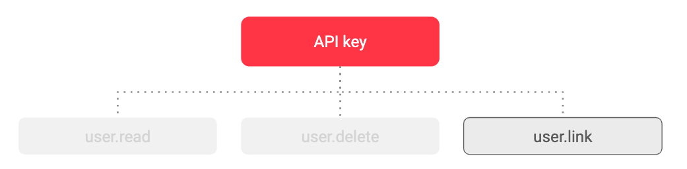
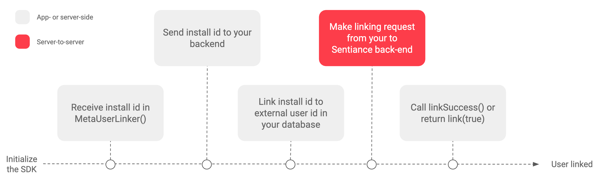
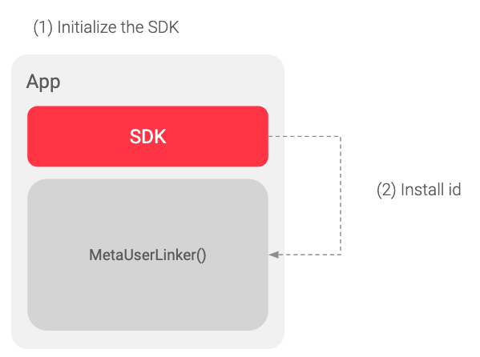
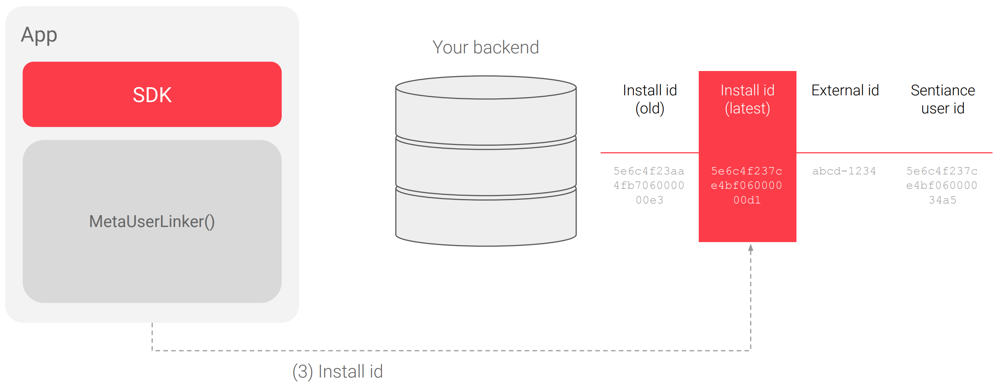

# User linking

### What is user linking?

User linking is our way of linking the unique user identifier in your database to a unique user identifier in our database. This is needed to keep track of users when they switch from one device to another or when multiple users use the same device.

### **Why do we need this?**

Our platform is set up so that a lot of the processing and calculation is done on our end. For example, some of our algorithms will look at a user’s historical events to make decisions about what a user is currently doing. As a result, we need to bundle past events so we know which ones were carried out by the same user. As is the case in most software products, we use a unique identifier for this purpose. We call it the ‘user id’. This user id might, and actually will in many cases, be different from the unique identifier you use in your own database. So let's call the unique identifier you use ‘**external user id**’ so we can differentiate between the two. We will call ours '**Sentiance user id'**.  
  
To make sure changes on your side are reflected on our side, it is important that our databases share information. For example, a user might change from one device to another. This is information that will arrive on your database, but not on ours. So when this happens, a call is needed from your backend to our backend to tell us that the user switched devices. We will then add the data from the new device to the data we already had from the old device.

The user linking process below will clarify both the in-app calls to your backend and the server-to-server communication from your backend to our backend. Both of these are required to make user linking work.

### **A short overview of our terminology**

| ID | **Description** |
| :--- | :--- |
| Sentiance user id | Unique identifier used by Sentiance to identify a user. |
| External user id | Unique identifier used by you to identify a user. |
| Install id | Unique identifier generated on every new app install with our SDK. |

## **Setting up user linking for your app**

As we mentioned above, user linking requires setting up both in-app calls to your backend and server-to-server communication from your backend to our backend. We recommend starting with the app-side integration.

### **Before you start** 

User linking should automatically be enabled for your app. If you think you are not getting the right response\(s\) from our database, it is worth double-checking if it is enabled by sending a quick mail to [support@sentiance.com](mailto:%20support@sentiance.com). 



For the server-to-server communication, you will need a way to authenticate the calls you are making. Backend authentication at Sentiance is done using [API Keys](https://docs.sentiance.com/backend/authentication-and-authorization#api-keys). For the user linking process to work, the API Key needs to have at least the ‘user.link’ scope assigned. Make sure you have the API Key set up before you proceed.


It is important not to use the API Keys in any way or form from within the app. This would pose a serious security risk. API Keys should only be used in the server-to-server integration.


### **App- or server-side integration**

After initializing the SDK, the SDK will try to initiate user linking. Subsequently, the app will have to contact your backend to pass through the install id mentioned above. Read more about the in-app methods that need to be called below.

### **Server-to-server integration**

After your backend has received the SDK install id, it will have to communicate with our backend to inform us which external user id is now linked to this install id. Read more about user linking communication with our backend below.



## **App- or server-side integration**

### **Summary of steps involved**

The user linking process on the app-side involves the following steps:

1. Initialize the SDK
2. Receive the unique install id from the SDK in the MetaUserLinker
3. Send that install id to your own backend.
4. Link the install id to your external user id in your own database
5. _\(Server-to-server\) Make linking request from your to Sentiance back-end_
6. Call **linkSuccess\(\)** or return **link\(true\)**

You can find more details on each step below. After you have finished these steps, there are a few more steps involved for the actual server-to-server communication. You can find these in the next chapter.  


### **Receive the unique install id from the SDK**

The first step involves receiving the install id from the SDK so you can send it to your backend in the next step. The SDK will pass the install ID to the following method. In this method, you must initiate a link request towards the Sentiance API \(via your server\), supplying the install ID and the external user ID. On iOS, you need to call either `linkSuccess` or `linkFailed` to capture whether the request was successful. On Android, the `link` method of your [`MetaUserLinker`](../sdk/api-reference/android/metauserlinker.md) object will expect either a `true` or `false` returned from it. Alternatively, if you use [`MetaUserLinkerAsync`](../sdk/api-reference/android/metauserlinkerasync.md), you can initiate linking asynchronously and inform the SDK of the result by calling the [`MetaUserLinkerCallback`](../sdk/api-reference/android/metauserlinkercallback.md) object's `onSuccess` or `onFailure` method. [Read more about these calls here. ](https://docs.sentiance.com/sdk/appendix/user-linking#usage)




To know if you need to return either a success or failure \(see following\), you will need to do the server-side integration first \(see following sections\). Only if you receive a ‘success’ response from our server, has linking actually been successful and can you call the linking success method.  




Specify a **MetaUserLinker** in the **SENTConfig**.

```text
MetaUserLinker metaUserlink = ^(NSString *installId, 
  void (^linkSuccess)(void), void (^linkFailed)(void)) {
    // Use installId to initiate a link request here, and call
    // linkSuccess() after linking succeeds.
}
//SDK configuration
SENTConfig *config = [[SENTConfig alloc] initWithAppId:APPID
                                         secret:SECRET
                                         link:metaUserlink
                                         launchOptions:launchOptions];

[sdk initWithConfig:config 
            success:^{
                // Init success
            }
            failure:^(SENTInitIssue issue) {
                // Init failed with reason <issue>
            }];
```

During initialization, the SDK will pass the installID to the `MetaUserLinker`. In this method, you must initiate a link request towards the Sentiance API \(via your server\), supplying the installID and your app’s userID.

After linking succeed, call `linkSuccess()`. If it fails, you must call `linkFailed()`. The SDK initialization will then fail with reason `LINK_FAILED`.



Specify a **MetaUserLinker** in the **SdkConfig**.

```objectivec
class CustomMetaUserLinker implements MetaUserLinker {
    boolean link(String installId) {
      // Use installId to initiate a link request here, and return 
      // true after linking succeeds.
  
      // This method will execute on a background thread.
    }
}
 
SdkConfig config = new SdkConfig.Builder(APP_ID, SECRET, notification)
                ...
                .setMetaUserLinker(metaUserLinker)
                .build();
 
Sentiance.getInstance(this).init(config, initCallback);
```

During initialization, the SDK will call the [`link(String)`](../sdk/api-reference/android/metauserlinker.md#link) method of your [`MetaUserLinker`](../sdk/api-reference/android/metauserlinker.md) object from a background thread, passing to it the SDK install ID. In this method, you must initiate a link request towards the Sentiance API \(via your server\), supplying the install ID and your app’s User ID.

[`link(String)`](../sdk/api-reference/android/metauserlinker.md#link) must return true only after linking with the Sentiance API succeeds. If linking fails, you must return false. The SDK initialization will then fail with reason `LINK_FAILED`.



### **Send that install id to your own backend**

As mentioned in the previous section, the call to your back-end should happen in the metaUserLinking\(\) method. How you make this call depends entirely on your own preferences and there are numerous ways of doing this. 

### **Link the install id to your external user id**

Like the previous step, there are numerous ways of linking the install id to the external id in your backend. The resulting data structure should look something like this:

**Adding new install id’s to a new column every time there is a new install.** 

| \*\*\*\* |  |  |  |
| :--- | :--- | :--- | :--- |
| Install id \(old  \) | Install id \(most recent\) | External user id | Sentiance user id |

**Replacing the install id every time there is a new install.** 

| \*\*\*\* |  |  |
| :--- | :--- | :--- |
| Install id | External user id | Sentiance user id |

It is not required, but preferred to store the Sentiance user id in the same table. This will allow for easier debugging later on.



## **Server-to-server integration \(API\)**

The server-side integration will make sure the install id and the external id you have received from the SDK-enclosed app, are sent to our server as well. Doing so requires only one call, on which you can find more information [here](https://docs.sentiance.com/backend/rest-api#user-link).

The call requires you to share both the **install id** and the **external user id** for that user. When received by our back-end, either one of three things can happen:

1. The external id **is recognized by our backend** and we now link the new install id to the existing sentiance user id. You will get back the sentiance user id. 
2. The external id **is not recognized by our backend** and we now assume you are trying to create a new user. Any subsequent linking call for that same external user id will now be linked to the now created sentiance user id. You will get back the sentiance user id. 
3. The install id **is not recognized as belonging to this application**. You will be denied from linking to this install id and be returned a 403 \(or 404 if the install id does not exist\).



User link



Used to link an Install ID to your system's UserID. The JSON body should contain a single parameter as described below.






The unique id of the install returned by the SDK in the linker callback method \(install id\).





This endpoint can ONLY be called with an API Key with \`user.link\` scope. User tokens will be rejected.





The unique id used by your backend to identify a user \(external user id\).










```

```






Making this call will require the use of a [valid API Key](https://docs.sentiance.com/backend/authentication-and-authorization#api-keys) with the scope user.link. If you don’t have an API Key set up yet, you will have to do that first.


### **There are a few security considerations while implementing the user linking process.**

* **Do not hardcode the Sentiance app secret in your app**. Instead, securely retrieve and store it for future runs
* Use a secure connection and an authorization mechanism when sending link requests from your app to your server. This ensures that malicious requests do not get forwarded to the Sentiance API.
* Use certificate pinning if possible.
* Use Android's SafetyNet Attestation to verify that requests to your server are coming from a certified apk.

### **All of this comes together in the following diagram.** 


