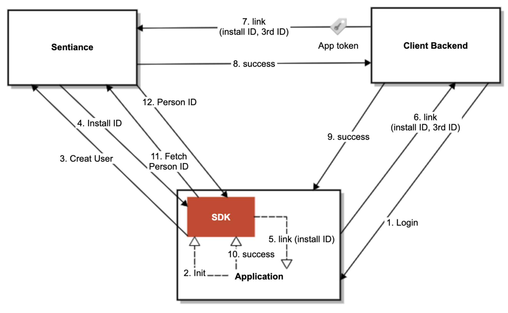

# User Linking

## Motivation

On every install of an app which embeds the Sentiance SDK, our system generates a new UserID. Normally this is not a problem. But in today's world of constantly changing phones and end-users installing/uninstalling an app multiple times, it can be hard to keep track of these multiple UserIDs generated on each install, and map them to their corresponding account on your system.

Classically customers have solved this problem by maintaining a one-to-many mapping of their own user account data to the Sentiance User IDs generated on each install.

But this is cumbersome, and requires a lot of work from you, our customer. Moreover, each new install is seen as a new user in our system. These users do not share a timeline and the thorough analysis we'd already one is lost on the next iteration.

We can do better.

## Introducing, User Linking

The User Linking feature allows you to associate your External UserID \(i.e., the account they already have in your own system\) to the UserID on the Sentiance Platform. 

We introduce a new term, the Install-ID. When the SDK initializes, you receive an ID as usual, but instead of calling it a UserID, we refer to it as the Install-ID, since it is unique to that installation of the app and a re-install would generate a new Install-ID.

By linking these disparate Install-IDs with a single UserID on our system, we unify the timelines and maintain a continuous data analysis and inference. Furthermore we also associate this UserID to the account information from your system.

During initialization, the Sentiance SDK authenticates and creates a new Install-ID to associate with the app. If the app is re-installed or the user moves to another device, a new install-ID is created. User Linking is a way to associate these disparate install-IDs to one canonical person, using your app's user ID.

1. User login completes on the app.
2. As a result, the app initializes the Sentiance SDK for the first time.
3. The SDK sends a user creation request to the Sentiance API.
4. The Sentiance API returns an install ID in response.
5. The SDK calls the link method of the app's UserLinker implementation, passing the install ID.
6. The app creates a request containing the install ID and possibly the third party ID, and sends it to the client backend.
7. The client backend, after authenticating the request, creates a new linking request with the install ID and third party ID, and send it to the Sentiance API.
8. The Sentiance API authenticates the requests with the API key, then performs user linking by associating a person ID and a third party ID to the install ID, and finally returns the response.
9. The client backend forwards the response to the app.
10. The app calls the SDK's success callback method.
11. The SDK sends a request to the Sentiance API to fetch the person ID just associated with the install ID.
12. The SDK receives the Person ID and completes the initalization.

## Prerequisites

**User linking should automatically be enabled for your app. If it looks like it is not enabled, please ask your sales representative about this or contact support at** [**support@sentiance.com**](mailto:support@sentiance.com). 

The feature uses a process we call Linking, in which we need to receive an HTTPS call from your backend telling us which External UserID \(from your system\) you wish to associate with a specific Install-ID \(from our system\). This requires the use of a API Key for authentication and thus a server side implementation on your end. **For user linking to work, the API key used should have the scope 'user.link'.** 


Do not send us the Linking request directly from a mobile device. This would require the API Key to be present on the mobile device and could lead to a security breach.


## SDK

During initialization of a User Linking-enabled app the SDK will call the `link(String)`method of your `MetaUserLinker` object from a background thread, passing to it the SDK **Install-ID**. In this method you must call your server and send it the **Install-ID**. Your server must then call ours, sending us the **Install-ID** and the **External UserID** \(this is the ID of the user on your system\).

For details please check out: [SDK Config for User Linking](../sdk/appendix/user-linking.md#usage)

## API

Check out the [reference for the Linking call.](../backend/rest-api.md#user-link)

If Linking succeeds you will receive the Sentiance ID associated with the user. All future associations of an Install-ID with one of your system's user IDs will return this same Sentiance ID.

If the Linking fails, you will be returned an error. For details please check out: [User Linking API Reference](../backend/rest-api.md#user-link)

