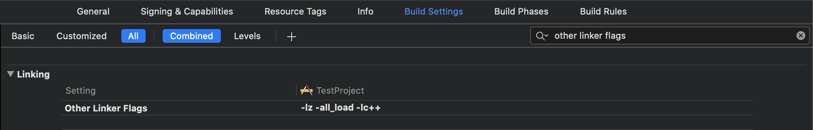

# Manual Installation

## Including the SDK

Download Sentiance iOS SDK: [Sentiance iOS SDK 5.6.1](https://sentiance-u1-sdk-downloads.s3-eu-west-1.amazonaws.com/ios/frameworks/SENTSDK-5.6.1.framework.zip)

After you've downloaded and unzipped the SDK, import it as a linked framework in your Xcode project:

1. Go to the **General** tab of your target settings
2. Click the **+** button under the **Frameworks, Libraries, and Embedded Content** heading
3. Click **Add Other** and then **Add Files**
4. Choose the Sentiance framework file and click **Open**
5. After the item has been added to the list, change the **Embed** option next to the framework to **Do Not Embed**
6. Depending on your Xcode setup, it might be required to add the following libraries: **libz.tbd \(previously libz.dylib\), CoreMotion, SystemConfiguration, CoreLocation, Foundation, CallKit, CoreTelephony, CoreData**

You'll also need to include the SDK bundle in your project:

1. Go to the **Build Phases** tab of your target settings
2. Expand the **Copy Bundle Resources** row and click the **+** button
3. Choose the **SENTSDK.bundle** file located inside **SENTSDK.framework**

\*\*\*\*

## Build Settings

1. Go to the **Build Settings** tab of your target settings
2. Look for **Other Linker Flags** in the **Linking** section
3. Add `-lz`, `-all_load` and `-lc++`

