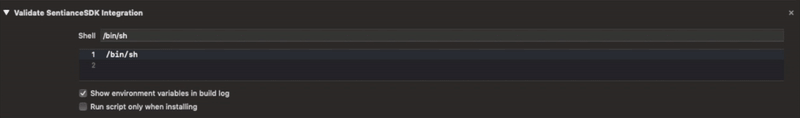
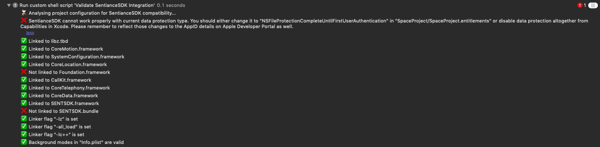

# Using Integration Guide

Sentiance SDK is shipped with an optional feature to guide you through your integration process in an interactive way from Xcode. The Integration Guide diagnoses Sentiance SDK integration from Xcode during build and alerts upon issue discovery.


 Using the Integration Guide is highly recommended but is not mandatory to benefit from all the features of Sentiance SDK.


## Minimum Requirements

The minimum requirements for the Integration Guide are,

* Xcode 10,
* Python 2.7.10

## How to Activate the Integration Guide

Follow these steps below to activate the Integration Guide:

1. In Xcode, select your project and go to **Build Phases.**
2. Add a **New Run Script Phase** using the '+' sign at the top left corner.
3. Add **"/bin/sh"** at the beginning of your script, followed by a space.
4. Find the **Sentiance SDK framework file** in your Xcode project and **drag it** at the end of the script.
5. Finally, finish your script adding **"/Resources/.main.sh".**

```
/bin/sh /Users/<UserName>/<ProjectName>/SENTSDK.framework/Resources/.main.sh
```




Once the script is finished, the phase will run everytime you build your project and will notify you with the status of your integration details in **Report Navigator** panel of Xcode.




