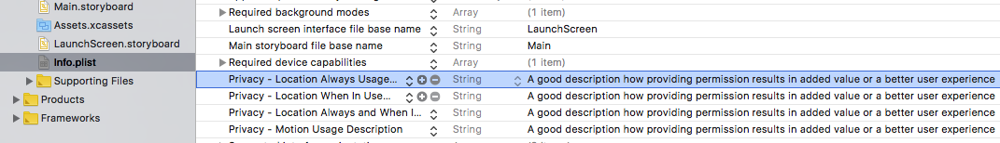

# 4. Tips and Guidelines

Apple provides some useful tips about [Requesting Permissions](https://developer.apple.com/design/human-interface-guidelines/ios/app-architecture/requesting-permission/) as part of their Human Interface Guidelines.

In addition to that, below are the things to consider for an optimal user experience:


Starting from version 5.6.0, Sentiance iOS SDK no longer asks for Motion Activity Permission and therefore it must be handled in the app level. Please note that Sentiance platform requires Motion activities for Lifestyle Profiling. For any questions, please contact our [support](mailto:support@sentiance.com).



Starting from the next Sentiance iOS SDK version, 5.7.0, the SDK will no longer ask for Location Permission.


### Privacy

* Request personal data only when your app clearly needs it.
* Explain why your app needs the information.
  * When the application requests permission for background locations or motion activities, a message will be shown to the user. You can configure this message by changing the value for the following keys in `Info.plist`
    * `NSLocationAlwaysUsageDescription`
    * `NSLocationWhenInUseUsageDescription`
    * `NSLocationAlwaysAndWhenInUseUsageDescription`
    * `NSMotionUsageDescription`


Keep the text short and specific, use sentence case, and be polite so people don't feel pressured. There’s no need to include your app name.


### Consistency

* Request permission at launch only when necessary for your app to function. 
* Use the system-provided alerts. 

### Efficiency

* Don’t request location information unnecessarily.

